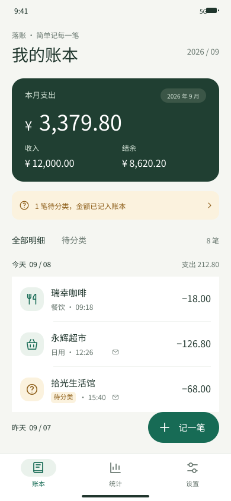
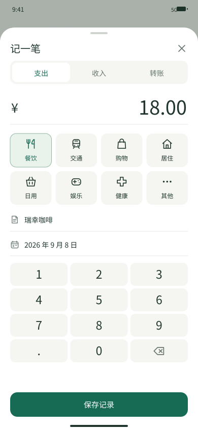
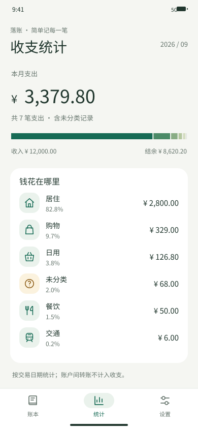

# 02｜页面与交互规格

## 信息架构

主导航只有三个入口：

1. **账本**：月度汇总、日期分组明细、全部/待分类筛选、记一笔入口。
2. **统计**：本月支出、收入、结余、分类占比和金额排名。
3. **设置**：商家规则、账本周期、邮件导入、导出、备份恢复。

手动记账、交易详情、编辑记录和分类纠错使用底部弹层。邮件导入和商家规则是设置的二级页面。

## 账本首页

* 顶部显示当前月份。
* 月度卡片优先显示支出，同时显示收入和结余。
* 记录按日期分组；每行显示分类图标、商家、分类、时间、录入来源和金额。
* 待分类记录也显示在普通明细中，并计入当月金额。
* “待分类”提示条点击后筛选所有未分类记录。
* “记一笔”按钮固定在便于单手触达的位置，但不能遮挡最后一笔记录。

## 手动记账

默认进入“支出”，用户可以切换收入或转账。常用流程是：选择分类 → 输入金额 → 保存。商家/备注允许为空，日期默认当天。

金额为零或格式非法时不允许保存；保存期间按钮禁用，避免连点生成重复记录。保存成功后关闭弹层并在账本中显示新记录；写入失败则保留用户输入。

## 分类纠错

用户可以选择：

* **仅修改本笔**：默认选项，其他记录不变。
* **以后该商家都这样分类**：保存个人规则，用于之后新导入的同商家记录。

个人规则优先，但不会自动重写历史记录。关闭弹层不会修改账目。

## 统计

统计按交易日期计算。未分类支出保留一个明确分类项；账户之间的转账不计入收入和支出。图形只用于快速判断结构，精确金额始终以文字显示。

## 页面状态清单

| 编号 | 页面/状态 | 核心内容                 |
| -- | ----- | -------------------- |
| 01 | 账本    | 月度汇总、日期分组、待分类筛选      |
| 02 | 手动记账  | 类型、金额、分类、商家、日期、数字键盘  |
| 03 | 统计    | 收支合计、分类占比与金额列表       |
| 04 | 设置    | 规则、邮件、导出、备份          |
| 05 | 邮件导入  | 可选功能说明与 Outlook 连接入口 |
| 06 | 分类纠错  | 分类选择与规则作用范围          |
| 07 | 交易详情  | 金额、分类、日期、来源、备注       |
| 08 | 空账本   | 手动记账主行动，邮件导入次行动      |
| 09 | 导入中   | 处理数量、进度、返回账本         |
| 10 | 导入失败  | 简短原因、重试、不影响现有账本      |
| 11 | 商家规则  | 用户规则列表               |
| 12 | 编辑记录  | 复用手动录入表单并预填字段        |

另有 360 vp 的账本和手动记账适配稿。
