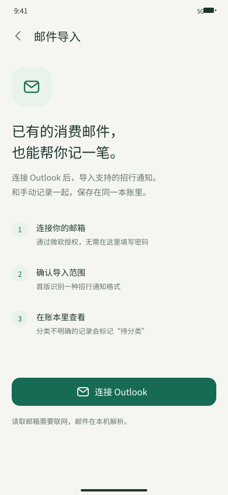

# 04｜数据逻辑与邮件辅助录入

## 统一记录模型

无论手动录入还是邮件导入，最终都成为同一种账本记录。基础字段至少包括：

* 稳定记录 ID
* 金额：使用整数“分”，避免浮点误差
* 币种
* 类型：支出、收入、转账
* 交易日期和时间
* 商家
* 分类
* 备注
* 录入来源
* 创建时间、修改时间和手动修改标记

商家允许为空。手动记账不应该因为用户没有填写商家而无法保存。

## 商家分类逻辑

分类优先级：

1. 本笔用户手动选择
2. 用户保存的个人商家规则
3. 本地已知品牌映射
4. 商家名称关键词候选
5. 未分类

商家的行业只能作为分类线索。综合商店、支付通道或模糊商家名不能保证每笔消费用途相同，因此低置信度结果应进入“待分类”，不猜测一个看似合理但可能错误的分类。

## 用户纠错

默认只修改当前记录。只有用户主动选择“以后该商家都这样分类”才创建个人规则。规则针对归一化后的完整商家名称，不把过短关键词自动扩展为模糊规则。

用户已经修改过的字段，重新同步时不能被覆盖；原始提取值和用户修正值分别保存，便于追溯。

## 邮件导入

首版仅支持 Outlook 和一种经过真实样本验证的招行邮件格式。邮箱授权、邮件读取和导入需要联网；解析、账本、分类规则和统计可以在手机本地执行。

导入记录额外保存：邮件唯一标识、同封邮件内条目编号、模板版本、原始提取字段和处理状态。

### 入账判定

* 金额、日期、收支方向可信，但分类未知：正常入账，分类为“未分类”。
* 金额、日期或收支方向不可信：保留为待核对导入项，暂不进入汇总。
* 退款、撤销、还款和账户间转账：必须依据交易类型处理，不能仅靠商家名判断。

### 去重

首选邮件唯一标识与条目编号去重。“同一天、同商家、同金额”只能产生疑似重复提示，不能直接删除，因为用户可能真实消费了两次。

如果用户先手动记录，后来邮件出现疑似相同交易，应让用户选择合并或保留两笔，不能自动覆盖手动账。

## 隐私边界

* App 不要求用户提供网银密码。
* Outlook 使用微软授权；正式权限说明必须明确读取范围和用途。
* 邮件导入可以随时停用，不影响手动账本。
* 不将邮件正文或账本默认上传到自建业务服务器。
* 导出和备份由用户明确触发。
