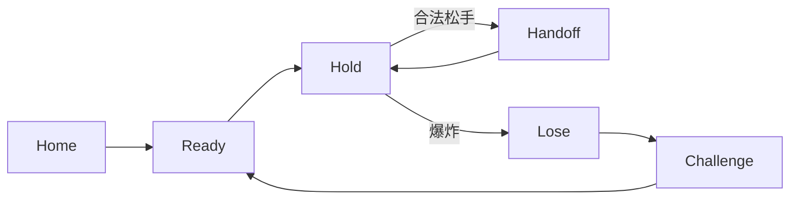

# 00｜实现合同总则与冻结范围

本章定义 NO.X v0.4 的**最终实现基线**。开发者不得把本文档理解成灵感、方向或参考。

## 产品首版唯一核心

> **两个人，一台手机。当前玩家按住一个小圆形 Core，同时回答屏幕问题。Bomb 在未知时刻爆炸；炸在谁手里，谁进入 Challenge。**

首版只需要把这条链路做得极强，不追求功能数量。

## 首版必须存在的 6 个主屏

1. Home / 首页
2. Round Ready / 回合准备
3. Bomb Pressing / 按压阶段
4. Bomb Tense / 紧张阶段（与 Pressing 同页面、不同状态）
5. Lose Reveal / 输家揭晓
6. Challenge Reveal / 挑战揭晓

不得新增中间业务页。Handoff 只允许使用覆盖层，不允许成为独立路由页面。

## 视觉基线

必须符合：

* 暗黑背景；
* 大面积暗紫；
* 霓虹粉 + 紫色高对比光效；
* 成人、暧昧、强烈、夜间；
* 接近 Wild 类产品的成熟度与吸引力，但使用 NO.X 自己的小圆形 Core；
* **不使用赛博蓝 / 青色作为主色**；
* **不使用卡通炸弹**；
* **不使用明显手指插画或手指提示图**；
* 背景人物摄影只作为气氛层，不覆盖主交互文字。

## 设计基准设备

* 设计画板：`390 × 844 vp`；
* 所有绝对尺寸以该画板为基线；
* 上安全区按 44vp 处理；
* 下安全区按 34vp 处理；
* 主内容左右固定 24vp；
* 主内容可用宽度：342vp。

其他手机尺寸只能按第 10 章规定缩放 / 重排，禁止自行重新设计。

## 首版明确不做

* Secret Match；
* Pack 商店；
* 账号；
* 登录；
* 云同步；
* 排行榜；
* 玩家昵称；
* 多人；
* 媒体录像验收；
* 统计分析；
* 成就；
* 广告；
* 社交；
* AI 生成挑战；
* 复杂设置。

这些能力可以存在于旧文档的长期规划中，但**不得进入 v0.4 首个可试玩版本**。
