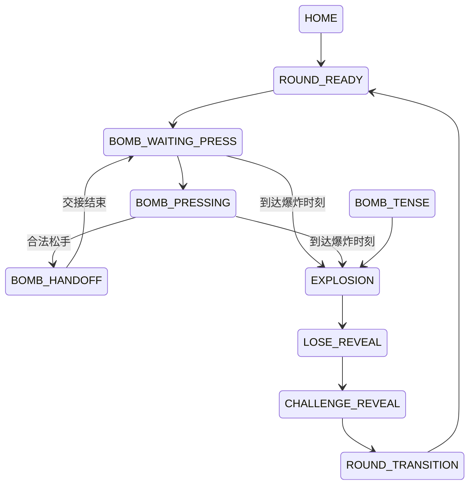

# 03｜状态机与数据模型：禁止页面自己决定流程

## 唯一合法主状态

```
HOME
ROUND_READY
BOMB_WAITING_PRESS
BOMB_PRESSING
BOMB_HANDOFF
BOMB_TENSE
EXPLOSION
LOSE_REVEAL
CHALLENGE_REVEAL
ROUND_TRANSITION
```

禁止新增同义状态。

## 唯一主流程



`BOMB_TENSE` 是 BombPage 内视觉状态，不是独立页面。

## GameSession 必须字段

```
roundIndex: number
holderIndex: 0 | 1
bombStartAt: number
bombExplodeAt: number
pressStartAt: number?
isPressValid: boolean
fakeSignalCount: number
currentPromptId: string
currentChallengeId: string?
state: GameState
```

## 固定常量

```
BOMB_MIN_DURATION_MS = 14000
BOMB_MAX_DURATION_MS = 30000
MIN_VALID_PRESS_MS = 1100
HANDOFF_PAUSE_MS = 1300
NEW_HOLDER_SAFE_MS = 400
MAX_FAKE_SIGNAL = 2
```

每轮爆炸时间只生成一次：`uniform integer [14000, 30000]`。PASS 后禁止重抽。

到时刻时当前持有手机者即输家。

## 验收

输出完整一轮状态日志，顺序必须符合本页。
