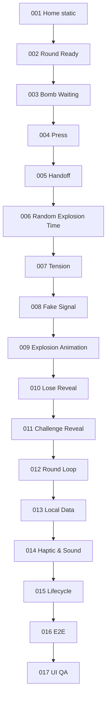

# 28｜任务依赖图与严格施工顺序

## 禁止并行乱做

v0.1 推荐单线程施工。弱模型不要同时做 UI 和核心状态。



## Gate 原则

一个任务进入下一任务前需要：

```
BUILD PASS
+ 当前任务所有 Axx PASS
+ 必交截图/录屏齐全
+ SPEC_GAP = NONE 或已人工明确允许延期
+ Git commit 完成
```

任何一项缺失不得进入下一任务。

## 允许返工

如果 T017 发现 T003 UI 偏差：

* 可以创建 FIX T003；
* 修复后必须重跑受影响的后续 E2E；
* 禁止因为已到 T017 就忽略早期规格。
