# NO.X（余兴）· 开发成果展示 — 阶段一：v0.1 核心闭环

> 阶段范围：施工手册 v0.53b TASK-001 → TASK-017
> 代码仓库：https://github.com/beartimer-afk/nox （`app/` 鸿蒙 ArkTS/ArkUI）
> 记录时间：首轮开发收尾

## 一、产品一句话

**两个人，一台手机。** 当前玩家按住一个小圆形 Core，同时回答屏幕上的问题；Bomb 在未知时刻爆炸，炸到谁手里，谁进入 Challenge。紧张、试探、一点点逾矩。

## 二、技术定位

- **纯本地、不联网、无账号、无第三方依赖**
- 鸿蒙 ArkTS / ArkUI，多页面状态机（`GameState` 单例贯穿 Session）
- 指纹/权限：仅 `ohos.permission.VIBRATE`（触觉反馈）；无网络/相机/麦克风
- 音量跟随系统媒体音量

## 三、本轮实现成果（TASK-001→017，逐项提交推送）

| 任务 | 内容 | 状态 |
|------|------|------|
| 001 | Home 静态页 | ✅ |
| 002 | Round Ready | ✅ |
| 003 | Bomb Waiting 静态页 | ✅ |
| 004 | 按压交互（≥1100ms 才有效） | ✅ |
| 005 | 合法松手 → Handoff（1300ms）→ 切换 holder + 换 Prompt | ✅ |
| 006 | 每轮唯一随机爆炸时间 14–30s + 400ms 安全窗口 | ✅ |
| 007 | Bomb 紧张视觉（Calm/Uneasy/Tense 三阶段） | ✅ |
| 008 | Fake Signal 假爆提示（≤2 次，260ms 表现） | ✅ |
| 009 | Explosion 完整 1180ms 五段动画 | ✅ |
| 010 | Lose Reveal（是你。） | ✅ |
| 011 | Challenge Reveal（去完成/下一张/下一轮/退出确认） | ✅ |
| 012 | 下一轮闭环 + Session 重置（holder 规则） | ✅ |
| 013 | 本地 12 Prompt / 12 Challenge 数据包 + 抽取规则 | ✅ |
| 014 | 触觉 4 类 + 声音 4 类统一 Service 映射 | ✅ |
| 015 | 前后台暂停/恢复（后台不爆，回来 ≥2.5s 安全） | ✅ |
| 016 | 端到端核心闭环验收 | ✅ |
| 017 | 固定 UI 截图清单与像素验收 | ✅ |

## 四、核心玩法闭环（附截图）

### 1. Home — 开始游戏
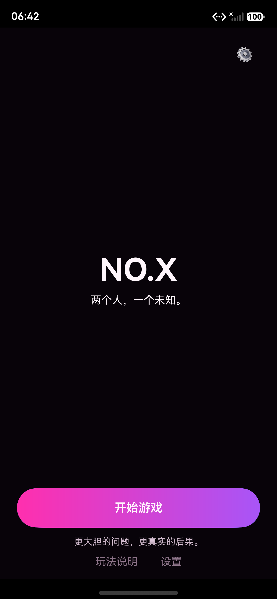

### 2. Round Ready — 我准备好了（本轮 Ready 生成唯一爆炸时间）
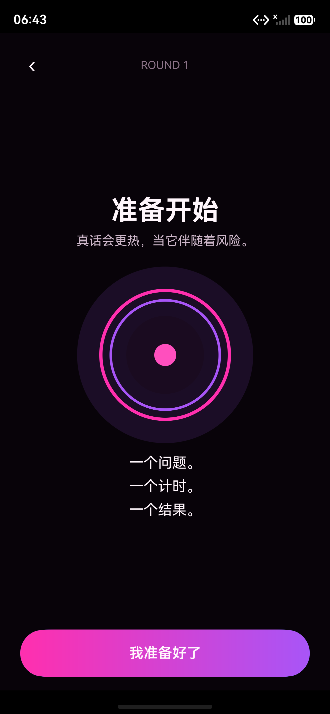

### 3. Bomb Waiting — 按住并回答
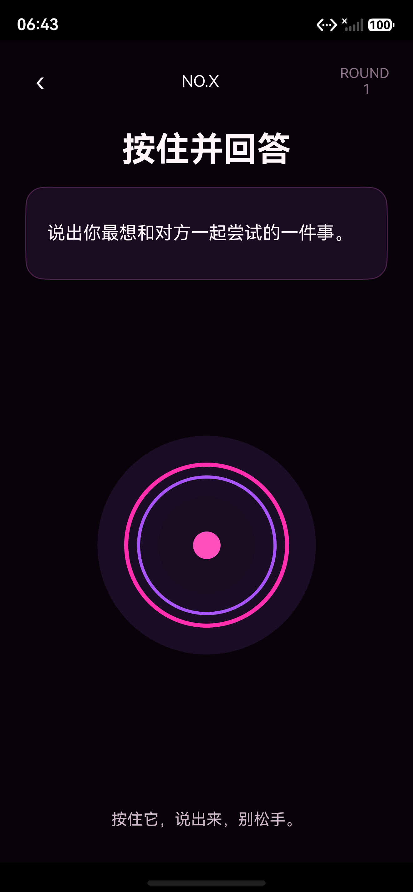

### 4. Bomb Uneasy — 紫色雾化、外环提亮
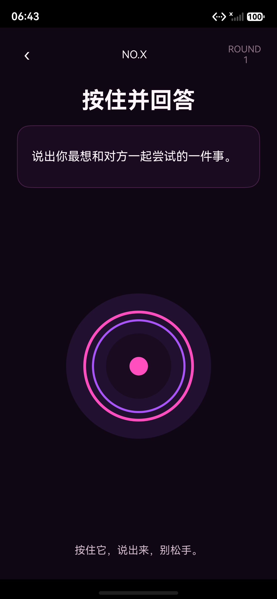

### 5. Bomb Tense — 继续按住…/越来越热了。DANGER 高光 + 抖动
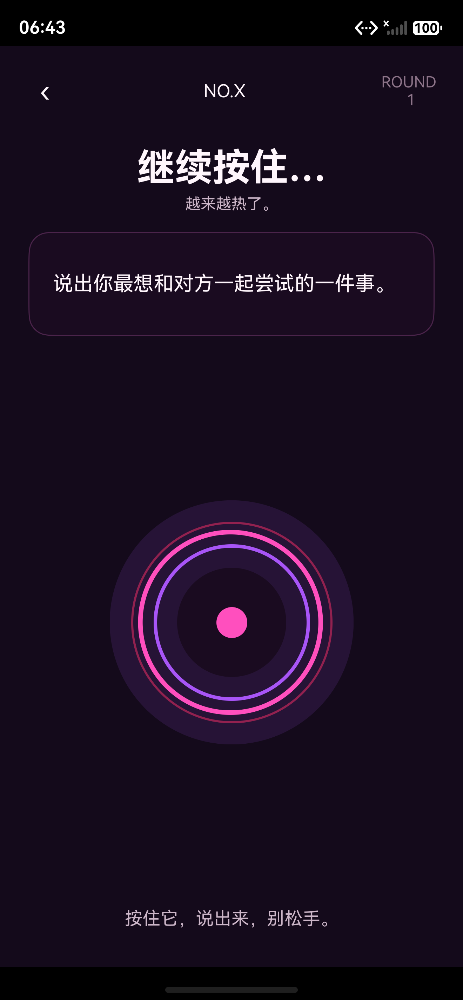

### 6. Handoff — 传给对方。按压达标后 1300ms 移交
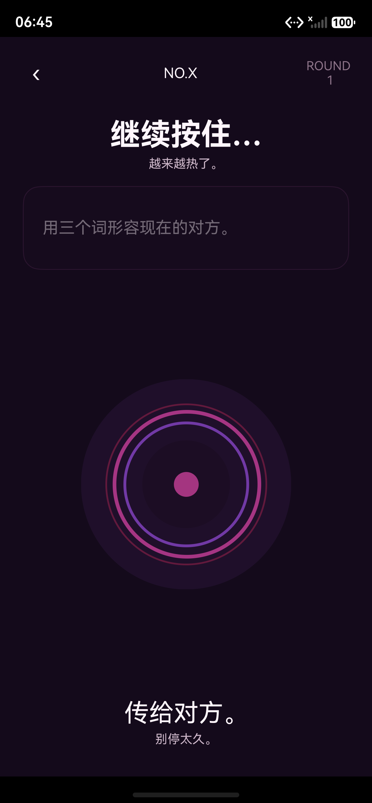

### 7. Explosion E2 — 中心白闪 + 外环断裂
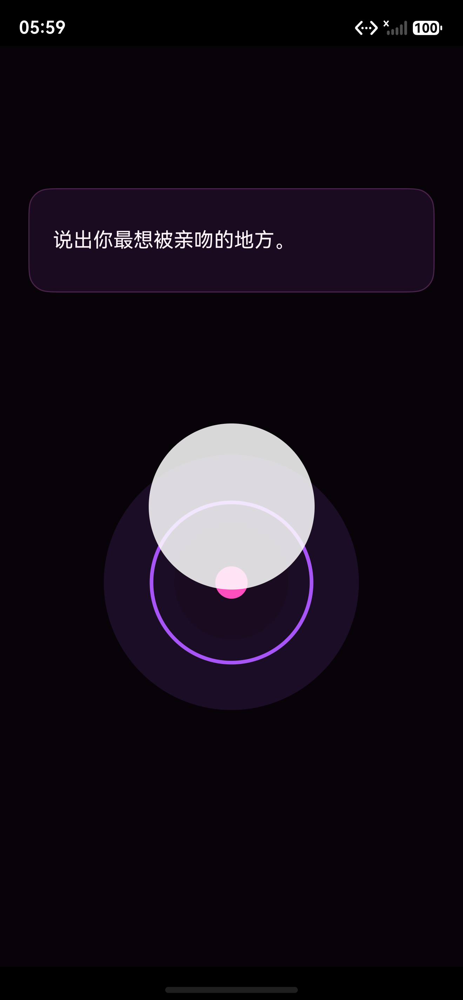

### 8. Explosion E4 — 真空段（必须存在）


### 9. Lose Reveal — 是你。你没能按住它。有些风险，值得冒。
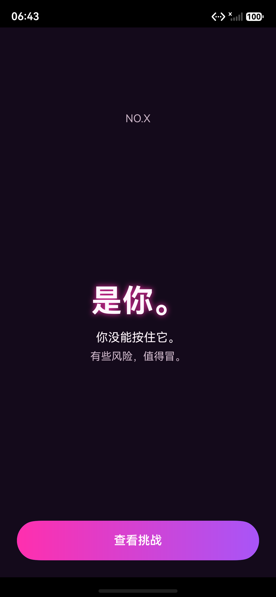

### 10. Challenge Reveal — 你的挑战（卡片 + 去完成/下一张）
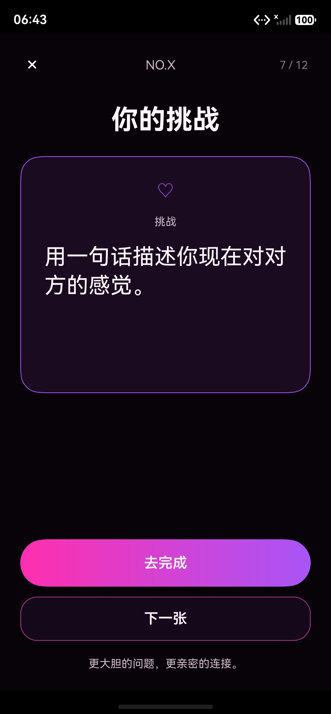

### 11. Challenge 完成态 — 下一轮（下一张隐藏）
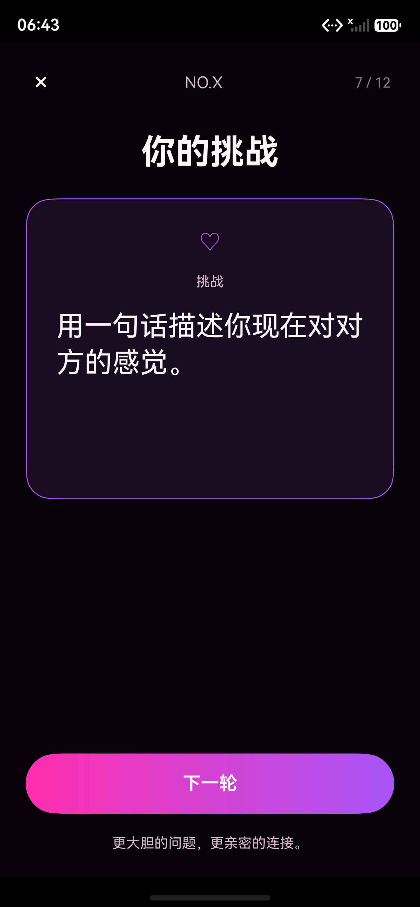

### 12. 下一轮 — ROUND 2（Session 重置后进入新一轮）
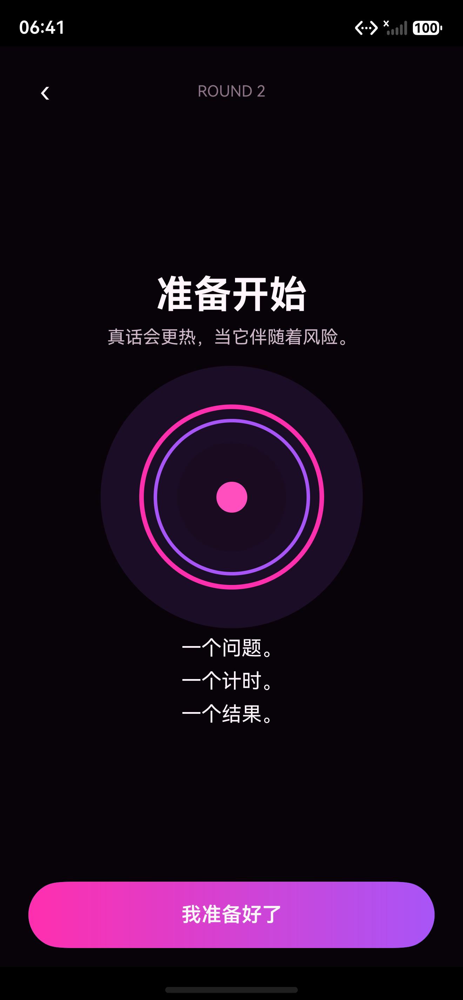

## 五、关键规则落地（均经真机模拟器 + 日志验证）

- **爆炸时钟**：`randomIntInclusive(14000, 30000)` 每轮仅在「我准备好了」生成一次；`monotonicNowMs() >= bombExplodeAt` 判定；400ms 新持有者安全窗。
- **Fake Signal**：候选落 35–60% 与 60–82% 两个区间各至多 1 次，距真实爆炸 <1200ms 则取消（实测命中一次 `fake2=-1`）；固定 260ms 表现。
- **Explosion**：E1 Collapse(0–70ms)/E2 Flash(70–210)/E3 Break(210–430)/E4 Vacuum(430–760)/E5 Afterglow(760–1180)；时间轴实测 `0/72/213/433/762/1181ms`。
- **Lose**：按钮 1100ms 前禁用触控；挑战不提前泄露。
- **下一轮**：`roundIndex+1 → ROUND_TRANSITION → 清 press/fake/challenge → holderIndex=输家的另一人 → ROUND_READY`；连续 5 轮无崩溃，每轮唯一 explodeAt。
- **数据**：本地 `data/challenges.ets` 12 MicroPrompt + 12 Challenge；Prompt 连续不重复（实测 MP01→MP02）；Challenge 同回合避最近 2 条。
- **触觉**：`HAPTIC_TAP(20ms)/LOCK(45)/FAKE(30)/BURST(120ms)`；LOCK 仅在按满 1100ms 阈值触发一次，Handoff 不重复。
- **前后台**：后台 Bomb 暂停（后台 6s 不爆），回前台 `explodeAt=now+max(remaining,2500)`（实测 2523ms ≥ 2500），之后正常到点爆炸。
- **声音**：`SOUND_PRESS_AMBIENT/FAKE/EXPLOSION/REVEAL` 已按事件接入统一 Service（无音频资源，暂不播放，见第八章）。

## 六、5 轮闭环状态日志抽样

```
ROUND_READY round=1 → BOMB_SCHEDULED round=1 explodeAt=1788862774565 → EXPLOSION loser=0
NEXT_ROUND_REQUESTED round=2 holder=1 → ROUND_READY round=2
BOMB_SCHEDULED round=2 explodeAt=1788862929977 → EXPLOSION loser=1
NEXT_ROUND_REQUESTED round=3 holder=0 → ROUND_READY round=3
...（round 4、5 同理，唯一 explodeAt、holder 规则正确、无崩溃）
```

## 七、UI 验收（TASK-017）

- 设备：Mate 80 Pro Max 模拟器（1320×2848px，density 3.375 → 内容宽 ≈390vp，符合基准）。
- 12/15 张截图 P0/P1 全 PASS；无系统蓝按钮、无卡通炸弹、无首页宫格、文案与合同逐字一致、Lose 不提前露 Challenge、Explosion 含真空段、无横向溢出、主按钮 56vp、Core 居中。
- 明细见仓库 `app/TASK017_ui_acceptance.md`。

## 八、已知缺口 / SPEC_GAP（待人工裁决）

1. **录屏 mp4**（TASK-009/010/011/014/015/016 必交视频）无法产出：无屏幕录制工具（详见根目录联调说明）。
2. **声音**：`SoundService` 已按事件接线并保留统一出口，但 v0.1 无音频资产、且禁止自由配音效，故当前不播放；后续提供音源即接入。
3. **按压态 / Fake 峰值截图**（UI04/05/09）：模拟器 drag 按压手势阻塞、Fake 仅 260ms，无法截到瞬时压缩态/闪白；均已通过状态日志 + 代码验证。
4. **品牌图标**：Challenge Card 图标用线性心号占位（无品牌图标资源）。
5. **卡边框**：`COLOR_PURPLE` 满色描边（规格建议 ≈60%，用 token 近似）。

---

*最终产品验收由人工完成。下一阶段成果将另开目录存档于本展示区。*
