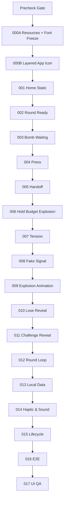

# 28｜任务依赖图与严格施工顺序

## 禁止并行乱做

v0.1 单线程施工。资源、UI、逻辑依次推进。



## 进入下一任务的固定 Gate

```
BUILD PASS
+ 当前 TASK 所有 Axx PASS
+ 必交截图/录屏/日志齐全
+ SPEC_GAP = NONE 或人工明确延期
+ 资源哈希（若本 TASK 涉及资源）PASS
+ Git commit 完成
```

任何一项缺失不得进入下一任务。

## Commit 固定前两项

* `NOX TASK-000A resources and font freeze`
* `NOX TASK-000B layered app icon`

之后继续一 TASK 一 commit。
